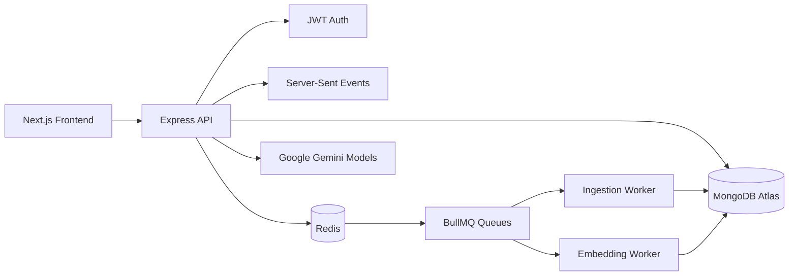
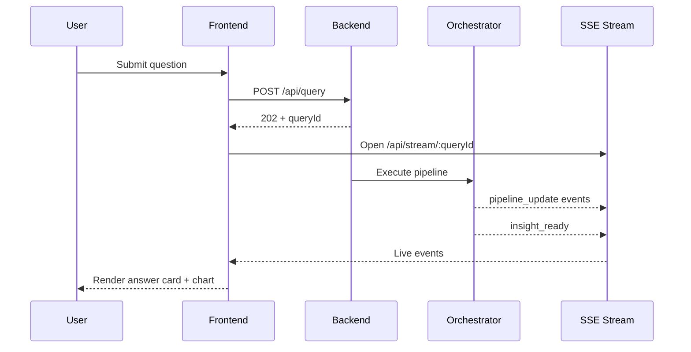

# DataLens: Talk to Your Data

A full-stack AI analytics system where users upload CSV/JSON data, ask natural-language questions, and receive structured insights with charts, confidence, and session memory.

Built for speed, demo-readiness, and production-minded architecture:

- JWT authentication
- User-owned datasets and chat sessions
- Queue-based ingestion + embedding pipeline (BullMQ + Redis)
- Real-time query progress via SSE
- MongoDB-backed analytics and history

---

## Why This Project Exists

DataLens solves a common problem:

- Business teams have data but cannot query it quickly.
- Analysts are overloaded.
- Dashboards are rigid and slow to iterate.

DataLens enables natural-language analytics with an interactive AI workflow, while preserving practical engineering concerns like auth, queueing, retries, and dataset ownership.

---

## Core Use Cases

### 1) Self-Serve Product Analytics

Upload product telemetry CSVs and ask:

- "Compare conversion between mobile and web"
- "Show anomalies in daily active users"

### 2) Sales and Revenue Insights

Upload sales exports and ask:

- "Break down revenue by region"
- "Compare Q1 vs Q2 growth"

### 3) Operations Monitoring

Upload operational logs and ask:

- "Find unusual spikes in processing time"
- "Summarize top failure contributors"

### 4) Fast Executive Reporting

Use chat sessions per dataset to build a narrative quickly:

- Follow-up prompts
- Persistent session history
- Re-open old datasets and related chats

---

## Architecture Overview



### Queue-First Ingestion Pipeline

1. File upload request is accepted.
2. Dataset metadata is created with `processingStatus=pending`.
3. Ingestion job is pushed to `ingestion` queue (if Redis available).
4. Worker parses, scrubs PII, infers types, profiles stats, chunks rows, persists metadata.
5. Embedding job is pushed to `embedding` queue (or run inline fallback).
6. Dataset becomes `ready`.

If Redis is unavailable, DataLens falls back to in-memory execution so demos still work.

---

## Tech Stack

### Frontend

- Next.js 14
- React 18
- Tailwind CSS
- Framer Motion
- Recharts
- Zustand

### Backend

- Express 5 + TypeScript
- MongoDB + Mongoose
- BullMQ + ioredis
- Google Generative AI SDK
- JWT + bcryptjs
- Winston logging

---

## Project Structure

```text
backend/
  src/
    config/        # db, redis, gemini
    controllers/   # auth, query, chat
    models/        # user, dataset, query, sessions, chunks
    pipeline/      # ingestion + query intelligence
    routes/        # auth, datasets, chat, query, stream
    workers/       # ingestion + embedding workers
frontend/
  app/
  components/
  lib/
```

---

## Prerequisites

- Node.js 20+
- npm 9+
- MongoDB Atlas (or compatible Mongo URI)
- Google Gemini API key
- Redis (recommended for BullMQ queues)

Optional:

- Docker Redis for local queue testing

---

## Environment Setup (Step-by-Step)

## 1) Backend environment

Create `backend/.env` and set values:

```env
# Required
GEMINI_API_KEY=YOUR_KEY
MONGODB_URI=YOUR_MONGODB_URI
JWT_SECRET=A_LONG_RANDOM_SECRET

# Recommended
PORT=4000
NODE_ENV=development
JWT_EXPIRES_IN=7d
REDIS_URL=redis://localhost:6379

# Gemini model overrides (optional)
GEMINI_EMBEDDING_MODEL=text-embedding-004
GEMINI_FLASH_MODEL=gemini-2.5-flash
GEMINI_PRO_MODEL=gemini-2.5-flash

# Optional networking and limits
MONGODB_DNS_SERVERS=8.8.8.8,1.1.1.1
MAX_FILE_SIZE_MB=50
QUERY_CACHE_TTL_SECONDS=3600
ASYNC_THRESHOLD_ROWS=5000
MAX_TOKENS_PER_QUERY=1500
RATE_LIMIT_GLOBAL=100
RATE_LIMIT_QUERY=30
```

Note:

- `embedding-001` is automatically remapped to `text-embedding-004` for compatibility.

## 2) Frontend environment

Create `frontend/.env.local`:

```env
NEXT_PUBLIC_API_URL=http://localhost:4000/api
```

## 3) Install dependencies

From repo root:

```bash
cd backend
npm install

cd ../frontend
npm install
```

## 4) Start Redis (recommended)

Option A: local install

```bash
redis-server
```

Option B: Docker

```bash
docker run --name datalens-redis -p 6379:6379 -d redis:7
```

## 5) Run backend

```bash
cd backend
npm run dev
```

Expected startup includes:

- Mongo connected
- Redis status printed as active or fallback mode

## 6) Run frontend

```bash
cd frontend
npm run dev
```

Open:

- Frontend: http://localhost:3000
- Backend health: http://localhost:4000/api/health

---

## First Run Walkthrough

1. Open app and register/login.
2. Upload a dataset (CSV/JSON) or load sample dataset.
3. Wait for processing to complete.
4. Open dataset dashboard.
5. Ask a question in chat.
6. Watch real-time pipeline status.
7. Receive insight card + chart.
8. Ask follow-up questions in same session.
9. Create/rename/delete sessions from sidebar.

---

## Dataset Ownership and Legacy Data

DataLens now enforces dataset ownership by authenticated user.

If you had datasets from before ownership was added:

- Frontend automatically calls `POST /api/datasets/claim-legacy` after login.
- Unowned legacy datasets are claimed for that user and then listed under "My Datasets".

---

## Authentication and Security Model

- JWT issued on `/api/auth/login` and `/api/auth/register`
- Protected routes:
  - `/api/datasets/*`
  - `/api/query`
  - `/api/stream/*`
  - `/api/chat/*`
- Password hashing via bcryptjs
- Headers hardening via helmet

---

## Real-Time Query Flow



---

## API Summary

## Auth

- `POST /api/auth/register`
- `POST /api/auth/login`
- `GET /api/auth/me`

## Datasets

- `POST /api/datasets/upload`
- `GET /api/datasets/sample`
- `GET /api/datasets`
- `POST /api/datasets/claim-legacy`
- `GET /api/datasets/:id`
- `GET /api/datasets/:id/status`

## Chat Sessions

- `POST /api/chat/sessions/ensure`
- `GET /api/chat/sessions`
- `GET /api/chat/sessions/:sessionId/messages`
- `PATCH /api/chat/sessions/:sessionId`
- `DELETE /api/chat/sessions/:sessionId`

## Query

- `POST /api/query`
- `GET /api/stream/:queryId`

---

## Queue and Worker Details

### Queues

- `ingestion`
- `embedding`

### Ingestion stages

1. Parse data (Papa Parse)
2. PII scrub
3. Type inference
4. Statistical profiling
5. Chunk and persist rows
6. Trigger schema embedding
7. Mark dataset ready

### Worker behavior

- Ingestion concurrency: 3
- Embedding concurrency: 2
- Embedding rate limiter configured
- Redis unavailable -> in-memory fallback path

This design gives reliability and throughput while still preserving a no-blocker local demo mode.

---

## Troubleshooting

### "My dataset is not showing"

1. Ensure logged into correct account.
2. Confirm backend running with same MongoDB URI used during upload.
3. Verify frontend `NEXT_PUBLIC_API_URL` points to active backend.
4. Check legacy claim path (automatic) by inspecting backend logs.

### "Pipeline stuck on processing"

- Frontend now has stream cleanup + timeout safeguards.
- Retry query in same session.
- Check browser network for `/api/stream/:queryId` lifecycle.

### "Redis unavailable"

- App still works in fallback mode.
- For queue mode, start Redis and restart backend.

### "Gemini embed model errors"

- Keep `GEMINI_EMBEDDING_MODEL=text-embedding-004`
- Avoid legacy `embedding-001` naming.

---

## Build and Production

## Backend

```bash
cd backend
npm run build
npm start
```

## Frontend

```bash
cd frontend
npm run build
npm start
```

Recommended production setup:

- Frontend and backend deployed separately
- Managed MongoDB and Redis
- Secrets managed via environment manager
- Add centralized logs and monitoring

---

## Team Notes

This codebase is designed to be:

- Demo-fast
- Queue-ready
- Auth-safe
- Extensible for additional sub-agents and custom analytics

If you are preparing for a hackathon demo, prioritize:

1. Redis up
2. Stable Mongo URI
3. Valid Gemini key
4. A cleaned sample dataset for predictable results

---

## License

MIT
